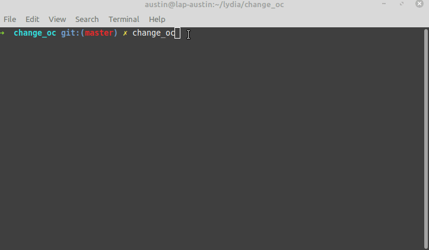
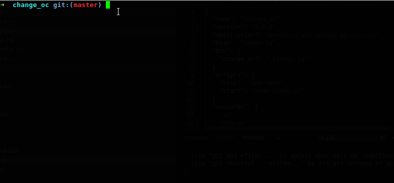

---

---

# Change_oc
[](https://www.gnu.org/licenses/gpl-3.0)
[](https://travis-ci.org/austincunningham/change_oc)
[](https://badge.fury.io/js/change_oc)
[](https://snyk.io/test/github/austincunningham/change_oc)


Some command line tooling to download, extract and set the version of `oc` on the local system. 

Downloads the compressed oc binary to this module and extracts the various oc versions to the following locations
```
/opt/openshift/
       |_ 3.7
       |_ 3.9
       |_ 3.10
       |_ 3.11
       |_ 4.1
       |_ 4.2
       |_ 4.3
       |_ 4.4
```

Sets the oc binary to execute by symlinking
```
/usr/bin/oc
```


## Prerequisite 
- node 10
- npm 
- os linux

## Installation
Installation from npm
```bash
npm install -g change_oc
``` 


Installation from source clone and install the repo
``` bash
git clone https://github.com/austincunningham/change_oc.git
cd change_oc
npm install
```

## Usage
From npm run the module
```
change_oc
```

From source run the npm start script and follow the onscrean instructions
``` bash
npm start
```
### Download

### Change binary


## Release Steps
- Make changes
- If nessary update README.md
- Update CHANGELOG.md
- Squash commits to single commit
- Commit the changes
- Bump the version in the package.json
- Remove package-lock.json and run `npm install`
- Second commit for version bump
- Merge changes from the PR
- Pull upstream changes to master
- Publish the changes `npm publish`